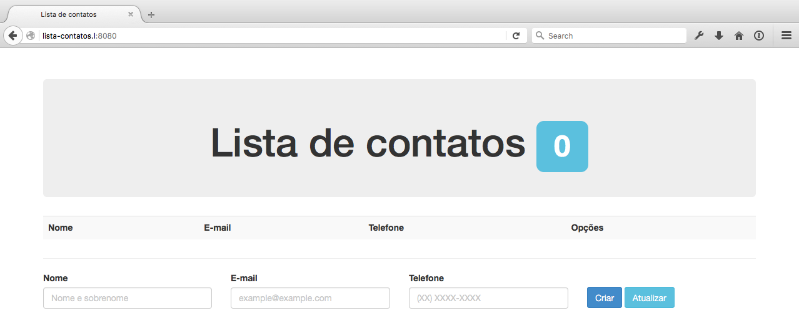

# Lista de contatos

> Projeto básico para estudar NodeJS baseado no [tutorial do Thales Bastos](http://thbastos.com/blog/criando-uma-aplicacao-em-nodejs-1-inicio).

## Módulos usados:

- [Express](https://www.npmjs.com/package/express)
- [Mongoose](https://www.npmjs.com/package/mongoose)
- [Morgan](https://www.npmjs.com/package/morgan)
- [Body Parser](https://www.npmjs.com/package/body-parser)
- [Method Override](https://www.npmjs.com/package/method-override)

## TO-DO

- [ ] Atualizar o Angular;
- [ ] Remover códigos duplicados;
